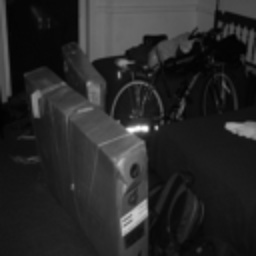
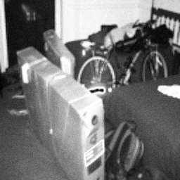
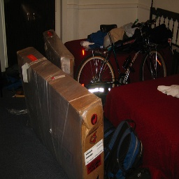
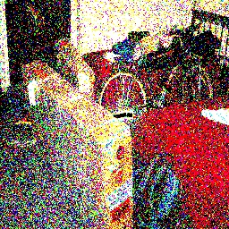

# ISQR-Model

Grayscale only : 

RGB doi: 

Implementation of ISQR model and its simulation

In this file we have shown the implementation of ISQR algorithm using Python Google Colab. in this file images are stored in google drive and the output are also stored in different directory of google drive. In this code we mainly focus on encoding pixel states instead of creating image matrix. The image matrix we thought of has already been created using several unitary gates. 

## Datasets

Coal Mines images dataset have been taken from internet and respective output is also shown 

ExDark Dataset have been taken from Github repository [Dark Image Dataset](https://github.com/cs-chan/Exclusively-Dark-Image-Dataset)

DOI: (https://doi.org/10.1016/j.cviu.2018.10.010)

## Theory

In this algorithm, sample datasets are stored in Google Drive and later retrieved and written back to a designated location within the drive. To ensure seamless execution, necessary libraries and dependencies are imported within the Google Colab environment. The quantum superposition state generated in this process is represented as \(\cos\theta|0\rangle+\sin\theta|1\rangle\), which is structured as a \(1 \times 2\) array in the `conv_img1_arcsin` function. The encoding process begins with the definition of the angle parameter in the `conv_rgb3_arcsin` function, followed by the classical-to-quantum encoding phase, where the equivalent superposition state is established through the `conv1_rgb_arcsin` function. Here, the angle \(\theta\) is derived using the `conv_img3_arcsin` function, ensuring accurate quantum representation. To facilitate randomness in quantum state selection, the `convert_a` function is employed to generate random outcomes from the superposition states. During the measurement process, the probability of obtaining the state \(|0\rangle\) is \(\alpha^2\), while the probability of obtaining the state \(|1\rangle\) is \(\beta^2\), aligning with the fundamental principles of quantum mechanics. After generating a random image, it is stored within the `convshots_bw_arcsin` function to compute the mean of multiple measurements, helping to reduce noise and enhance accuracy. In this study, measurement operations were performed 500 times to refine the clarity of the retrieved images, as quantum measurements inherently introduce probabilistic variations. To further improve the accuracy of the reconstructed image, a controlled measurement procedure was implemented, ensuring a reliable comparison between the classical image and its quantum-measured counterpart. Finally, the results, including the classical and quantum-measured images, were systematically recorded and stored in an Excel file for further analysis and validation.

## For RGB images work flow
To simulate this code, we have taken lo light images from ExDark [DOI: (https://doi.org/10.1016/j.cviu.2018.10.010)], and uploaded some samples in ibb image hosting in google colab.
convshots(Classical Image)-->conv1_rgb(Classical Image)-->conv_img1 (Taking Classical input and converting to superposition state)-->convert_a(Random measurement between two proabilistic components)--> Returns a measured classical value--> returns converted from conv_img1()--> conv1_rgb() merges the values for red, green and Blue--> returns image(measured pixel)--> multiple measurement is performed in convshots() and mean is calculated--> finally it returns converted classical pixel

### The functions of RGB codes
For RGB images, we are useing two functions, conv_img1() and conv_img3_arcsin(), both have same functionallity and both are creating superposition. But to visualize the superposition state classically, 255 is multiplied with the probability components of the conv_img3_arcsin() function. conv_img1() works on actual probability values to perform measurement. Finally convert_a() is used to perform randomized measurement in which the superposition state collapses to either of the basis state. After that 255 is being multiplied with the proability component for classical visualizatio n and it is generating enhanced result.

## Usage

To run this file you need to follow below steps:

1. Create venv in repo root directory. Use `python -m venv venv`
2. Activate it with `venv\Scripts\activate` on windows and `source venv\bin\activate` on linux.
3. Install the requirements with the activated venv as `pip install -r requirements.txt`
4. To run on provided sample folder use `python isqr_grayscale.py --input_folder E:\projects\ISQR-Model\sample_run_folder\input` on windows or `python isqr_grayscale.py --input_folder /home/user/ISQR-Model/sample_run_folder/input` on linux. Change the input directory name as per your requirement. Available options for `isqr_grayscale.py` are:

    - `--input_folder` : Specify full path to your input folder
    - `--rgb`: Toggle rgb or grayscale, expects True/False
    - `--plot`: Toggle to plot the image with matplotlib, expects True/False
    - `--number_of_shots`: number of times to perform measurement.

   Sample run command for rgb `python isqr_grayscale.py --input_folder E:\projects\ISQR-Model\sample_run_rgb_folder\input --rgb True`

## Sample Images(Grayscale)

Input

Output (500 shots)

## Sample Images(RGB)

Input

Output (1 shot)

